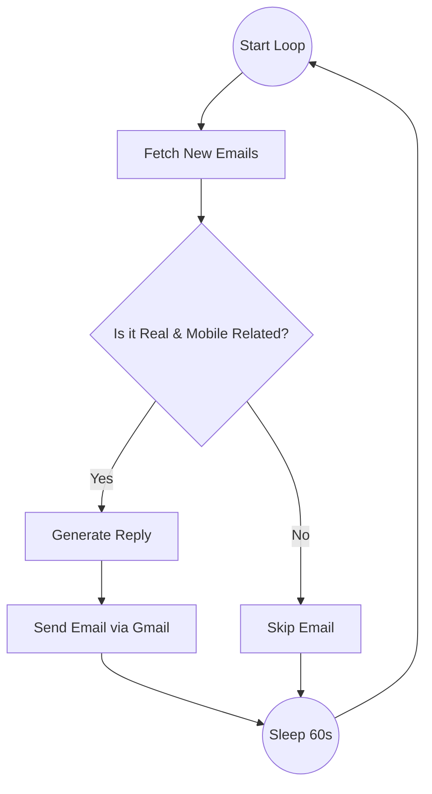

# 📧 Auto Mail Agent

**An Intelligent AI Assistant that replies to your customers while you sleep.**


## 📖 What is this?
**Auto Mail Agent** is a smart robot that lives on your computer. It connects to your Gmail, reads incoming emails, and decides wether to reply or not.
It is specifically designed for a **Mobile Store**. It filters out spam and marketing emails, and only replies to real humans asking about mobile phones.

## ✨ Key Features
*   **🧠 AI-Powered Filtering**: Uses **Groq (Llama 3)** to understand if an email is from a "Real Human" or a "Bot/Marketer".
*   **🛒 Niche Specific**: It ignores random emails and only focuses on **Mobile/Phone related inquiries**.
*   **✍️ Auto-Draft & Send**: It writes professional, polite replies and sends them automatically via Gmail.
*   **⏰ 24/7 Loop**: Runs every 60 seconds to ensure no customer waits too long.
*   **🛡️ Smart Security**: Uses official Google OAuth2 (no password sharing) and a secure local environment.

## 🛠️ The Technology Stack
*   **LangGraph & LangChain**: For managing the AI's "Thought Workflow" (Fetch -> Filter -> Reply).
*   **Groq API**: The ultra-fast AI model powering the intelligence.
*   **Google Gmail API**: The "Native Client" that handles reading and sending emails.
*   **Python**: The core programming language.

## 🏗️ Architecture (Visualized)
We use a **Native Client Architecture** that mimics an MCP server for simplicity and speed.



## 🚀 How to Install

1.  **Clone this repository**:
    ```bash
    git clone https://github.com/yourusername/auto-mail-agent.git
    cd auto-mail-agent
    ```

2.  **Get your Keys**:
    *   **Groq API Key**: Get it from [Groq Console](https://console.groq.com/).
    *   **Gmail Credentials**: Download `credentials.json` from Google Cloud Console (Desktop App Client).

3.  **Setup Environment**:
    Run the helper script to install dependencies:
    ```powershell
    # Windows
    .\auth_setup.ps1
    ```
    *(Or manually install `pip install -r requirements.txt`)*

4.  **Configure Secrets**:
    Create a `.env` file in the root folder:
    ```env
    GROQ_API_KEY=gsk_your_key_here
    ```

## 🏃♂️ How to Run

Just double-click or run the start script:

```powershell
.\run_agent.ps1
```

The agent will:
1.  Open a browser to log you in (First time only).
2.  Start checking your inbox every 60 seconds.
3.  Print its activity to the terminal.

## 📂 Project Structure

| Folder / File                | Description                                |
| :--------------------------- | :----------------------------------------- |
| `src/`                       | **The Brains**. Contains the Python logic. |
| `src/agent_graph.py`         | The main AI workflow logic.                |
| `src/gmail_client_native.py` | The custom Native Client for Gmail API.    |
| `run_agent.ps1`              | The startup script.                        |
| `requirements.txt`           | List of Python libraries needed.           |
| `.env`                       | **(Private)** Stores your API keys.        |
| `token.json`                 | **(Private)** Stores your login session.   |

## ⚠️ Important Notes
*   **Token Expiry**: The `token.json` refreshes automatically. You don't need to re-login unless you delete it.
*   **Safety**: This agent sends REAL emails. Test it with a secondary account first!

---

