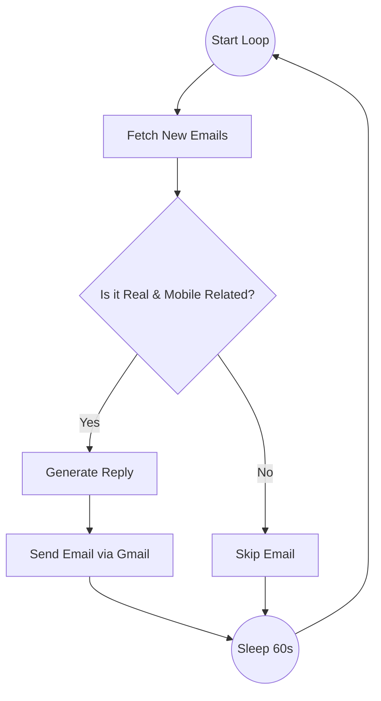

# Project Explanation

This file explains the project structure and every single file in simple words.

## 📂 Main Folders

### 1. The Root Folder (`auto-mail-agent`)
**The "Home Base"**
This is the main folder where everything starts. It holds the key scripts to run the robot and the configuration files that give it permission to work.

### 2. `src` Folder
**The "Engine Room" (Source Code)**
This folder describes *how* the robot works. It contains the Python code (logic) that makes decisions, reads emails, and sends replies.
*   **Purpose**: To keep the complex thinking code separate from the startup scripts.
*   **Why it exists**: If we put all code in one folder, it would be messy. This organizes the "brains" into one place.

### 3. `auto_mail` Folder
**The "Tool Box" (Virtual Environment)**
This folder contains all the external tools (libraries) the robot needs, like the Google tool to talk to Gmail or the tool to talk to the AI brain.
*   **Purpose**: A private workshop for this project.
*   **Why it exists**: To avoid mixing up tools with other projects on your computer.

### 4. `__pycache__` Folder
**The "Speed Folder"**
*   **Purpose**: Python uses this to store fast, pre-read versions of your code.
*   **Why it exists**: It makes the robot start up faster the second time you run it.

---

## 📄 Files in the Root Folder (Home Base)

### 1. `run_agent.ps1`
**"The Start Button"**
*   **Purpose**: This is the script you use to turn the robot ON.
*   **What it does exactly**:
    1.  It checks if your "Tool Box" (virtual environment) is active.
    2.  If not, it activates it.
    3.  Then, it commands Python to run the main code (`src/main.py`).
*   **Why it exists**: So you don't have to type long, complicated commands every time. You just run this one file.

### 2. `.env`
**"The Secret Note"**
*   **Purpose**: To store private passwords and keys that should never be shared.
*   **What it does exactly**: It holds your **Groq API Key**. The code reads this file to get the password it needs to talk to the AI.
*   **Why it exists**: Exact security. If you share your code, you don't accidental share your passwords because they are hidden in this file.

### 3. `credentials.json`
**"The Key Card"**
*   **Purpose**: This is a file you downloaded from Google. It proves your "App" is real.
*   **What it does exactly**: It contains the "Client ID" and "Client Secret" (like a username and password for the App itself, not you).
*   **Why it exists**: Google needs to know which App is trying to access Gmail. This file identifies your "Auto Mail Agent" app.

### 4. `token.json`
**"The Session Pass" (NOT a Password File)**
*   **Does it have my password?**: **NO.** It never stores your Google password. It stores a "Token" (a long string of random letters).
*   **What is it?**: Think of it like a **hotel key card**. The hotel front desk (Google) checked your ID (Password) once and gave you this card. You use the card to open your room (Gmail) without showing your ID every time.
*   **What about expiry?**:
    *   **Access Token**: The "key card" stops working after 1 hour (for security).
    *   **Refresh Token**: But the file also has a special "Renewal Pass". When the key card expires, the robot automatically uses the Renewal Pass to get a fresh key card from Google in the background.
*   **Do I have to log in again?**: **No.** As long as the "Refresh Token" is valid (which lasts for months or years), the robot does this automatically. You only log in again if you manually delete this file or if Google revokes your access for safety.

### 5. `requirements.txt`
**"The Shopping List"**
*   **Purpose**: A list of all the extra tools the robot needs to buy (download).
*   **What it does exactly**: It lists libraries like `langchain` (for AI logic) and `google-auth` (for Gmail).
*   **Why it exists**: We can ask the "Tool Box" (`auto_mail`) to install everything on this list in one go.

### 6. `auth_setup.ps1`
**"The Setup Helper"**
*   **Purpose**: A script to help set things up the first time.
*   **What it does exactly**: It usually helps create the virtual environment or run initial checks.
*   **Why it exists**: To make the installation process easier for beginners.

### 7. `setup_guide.md` & `PROJECT_OVERVIEW.md`
**"The Manuals"**
*   **Purpose**: Instructions for humans (you).
*   **What it does exactly**: Explains how to install and what the project looks like.
*   **Why it exists**: So you know how to use the software.

---

## 📄 Files in the `src` Folder (The Brains)

### 1. `main.py`
**"The Coordinator" (The Boss)**
*   **Purpose**: This runs the main loop. It controls *when* things happen.
*   **What it does exactly**:
    1.  It wakes up.
    2.  It tells the "Brain" (`agent_graph.py`) to checking emails.
    3.  It looks at the clock and says "Wait 60 seconds" before checking again.
*   **Why it exists**: To keep the robot running forever in a loop.

### 2. `gmail_client_native.py`
**"The Hands" (Gmail Tool)**
*   **Purpose**: This file actually touches your Gmail account.
*   **What it does exactly**:
    *   It has functions like `fetch_recent_emails()` to download emails.
    *   It has `send_reply()` to actually send an email back.
    *   It handles the technical dirty work of connecting to Google.
*   **Why it exists**: We want to keep the "Gmail connection" logic separate from the "AI thinking" logic.

### 3. `agent_graph.py`
**"The Brain" (The Thinker)**
*   **Purpose**: This decides *what* to do with an email.
*   **What it does exactly**:
    1.  It takes an email from "The Hands".
    2.  It looks at the sender: "Is this a real human?"
    3.  It reads the content: "Is this about mobile phones?"
    4.  If yes, it asks the AI to write a reply.
    5.  It gives the reply back to "The Hands" to send.
*   **Why it exists**: This is where the smart logic lives. If you want to change *how* the robot behaves (e.g., reply to laptop emails instead), you change this file.

### 4. `debug_auth.py`
**"The Repair Kit"**
*   **Purpose**: To fix login problems.
*   **What it does exactly**: If your `token.json` is broken or expired, you run this. It forces a new login window to open so you can re-approve the robot.
*   **Why it exists**: Sometimes connections break. This dedicated tool helps fix them without breaking the main robot.

### 5. `auth_manual.py`
**"The Backup Key"**
*   **Purpose**: An older or alternative way to log in.
*   **What it does exactly**: Similar to the Repair Kit, but might be a simpler version used during early development.
*   **Why it exists**: Often kept as a backup in case the main way fails.

### 6. `__init__.py`
**"The Python Tag"**
*   **Purpose**: A tiny empty file.
*   **What it does exactly**: It sits there and does nothing visible.
*   **Why it exists**: It tells Python: "Treat this folder (`src`) as a package of code".

---

## 🏗️ The Architecture (Technical Secret)

You asked about the **MCP Server**. Here is the secret:
*   **Do we use a separate MCP Server?**: **No.**
*   **What do we use?**: We built a **"Custom Native Client"** (`gmail_client_native.py`).
*   **How it works**:
    *   The "Brain" (`agent_graph.py`) *thinks* it is talking to an MCP server. It sends commands like "call_tool('search_threads')".
    *   But the "Native Client" intercepts these commands and runs them directly inside the same program.
*   **Why did we do this?**:
    *   **Simplicity**: You don't need to run two separate black boxes (a Server and a Client). You just run one script (`run_agent.ps1`).
    *   **Speed**: It's faster because the robot talks to itself effectively, rather than sending messages over a network connection to a local server.

---

## 🛠️ Tools & Libraries Used (The Toolkit)

These are the items listed in `requirements.txt`. Here is what they actally do:

### 1. `langchain` & `langgraph`
**"The Blueprint Maker"**
*   **Purpose**: These help us organize the robot's thinking.
*   **What they do**: Instead of writing "If this, then that" spaghetti code, these tools let us draw a "Graph" (like a flowchart). It helps us say: "First fetch email -> Then filter it -> Then reply".

### 2. `langchain-groq`
**"The Translator"**
*   **Purpose**: To talk specifically to the Groq AI.
*   **What it does**: It takes our plain English instructions ("Write a reply") and converts them into the specific complex code that the Groq AI understands.

### 3. `google-auth` & `google-api-python-client` (Hidden inside `src`)
**"The Keys & The Phone"**
*   **Purpose**: To handle Google security and calls.
*   **What they do**:
    *   **Auth**: Checking your keys (`token.json`) to make sure they are valid.
    *   **API Client**: The actual "phone" that dials Google's servers to ask for emails.

#### 🔍 Deep Dive: How we touch Gmail
You asked specifically about **Drafting** and **Sending**. We use `google-api-python-client` for this.
*   **To Read**: We use the command `service.users().threads().list()`. This is like clicking "Inbox".
*   **To Draft**: We actually don't save a draft on Gmail. We build the email in Python's memory using a tool called `EmailMessage`.
*   **To Send**: We use the command `service.users().messages().send()`. This is like clicking the "Send" button.

### 4. `python-dotenv`
**"The Safe Cracker"**
*   **Purpose**: To read the hidden `.env` file.
*   **What it does**: It runs once at the start, finds your `.env` file, and loads the passwords into the computer's memory so the robot can use them, while keeping them hidden from the screen.

### 5. `python-dateutil`
**"The Calendar"**
*   **Purpose**: To understand time.
*   **What it does**: Computers are bad at reading dates like "Yesterday at 5pm". This tool converts all those human dates into precise numbers so the robot can compare them (e.g., "Is this email newer than the last check?").

---

## 🔄 The Robot's Workflow (The Graph)

This is the exact flow chart (Graph) that is running inside `agent_graph.py`.

1.  **Fetch**: Grab the latest unread emails.
2.  **Filter**: The AI decides if it's junk or a real customer asking about mobiles.
3.  **Reply**: If valid, the AI writes a polite response.
4.  **Send**: The robot sends the email.
6.  **Sleep**: It waits 60 seconds and starts again.

---

## 🎬 The "Back End" Story: Step-by-Step

Here is exactly what happens, second by second, when you turn it on.

### 🏁 Phase 1: Startup (The Wake Up)
1.  **You click `run_agent.ps1`**:
    *   The script wakes up the "Tool Box" (`auto_mail` environment).
    *   It tells Python to run `src/main.py`.
2.  **`main.py` starts**:
    *   It reads `.env` to memorize your API passwords.
    *   It creates the "Hands" (`GmailNativeClient`).
    *   It calls `connect()`: The Hands read `token.json` to prove to Google "I am allowed to be here".
3.  **Graph Building**:
    *   `main.py` calls `create_graph()`. This draws the flowchart (Fetch -> Filter -> Reply) in the robot's memory.

### 🔄 Phase 2: The Loop (The Work)
Now the robot enters the "Infinite Loop" (`while True`).

#### Step 1: Fetching (The Eyes)
*   **Action**: The robot calls the tool `fetch_emails`.
*   **Behind the Scenes**:
    *   It asks Google: "Give me the last 3 unread emails."
    *   Google responds with a list.
    *   The robot checks the time: "Is this email newer than when I last woke up?"
    *   If **No**: It stops here.
    *   If **Yes**: It downloads the text of the email.

#### Step 2: Filtering (The Brain - Part 1)
*   **Action**: The robot calls the **AI** (Groq).
*   **Prompt**: It sends the email text to the AI with a secret note: *"You are a filter. Is this a real human asking about mobiles? Answer Yes/No."*
*   **AI Thinking**: The AI reads the text (e.g., "Hi, do you have iPhone 15?") and answers "Yes".
*   **Decision**:
    *   If **No**: The robot deletes the email from its memory (Skips it).
    *   If **Yes**: It passes the email to the next step.

#### Step 3: Replying (The Brain - Part 2)
*   **Action**: The robot calls the **AI** (Groq) again.
*   **Prompt**: *"You are a store owner. Write a polite reply to this customer."*
*   **AI Thinking**: The AI generates a text: *"Hello! Yes, we have the iPhone 15 in stock..."*
*   **Result**: The robot saves this draft reply.

#### Step 4: Sending (The Hands)
*   **Action**: The robot calls the tool `send_reply`.
*   **Behind the Scenes**:
    *   It takes the draft reply.
    *   It packages it into a real email format.
    *   It contacts Google and says "Send this now".
    *   Google sends it to the customer.

#### Step 5: Sleep (The Rest)
*   **Action**: `main.py` says `sleep(60)`.
*   **Result**: The robot pauses completely for 1 minute. Then it goes back to **Step 1**.
